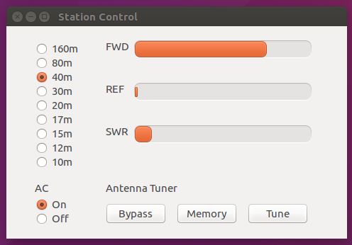
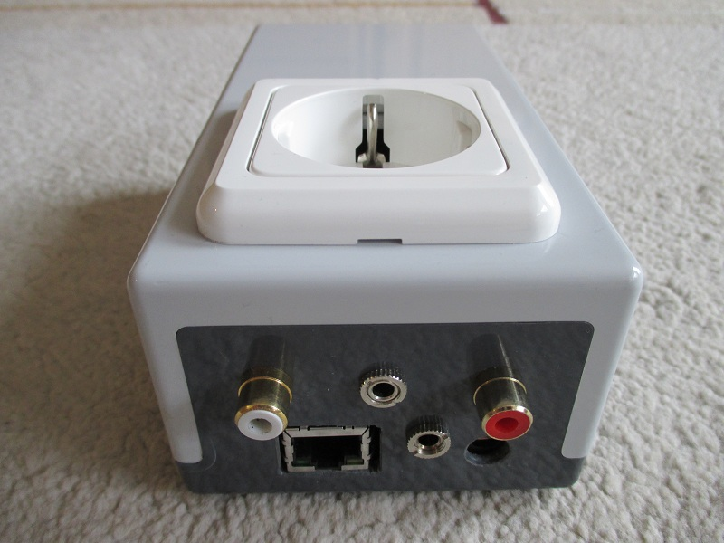
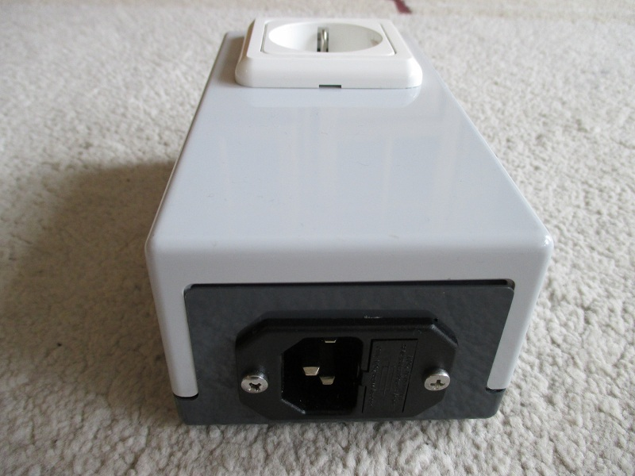
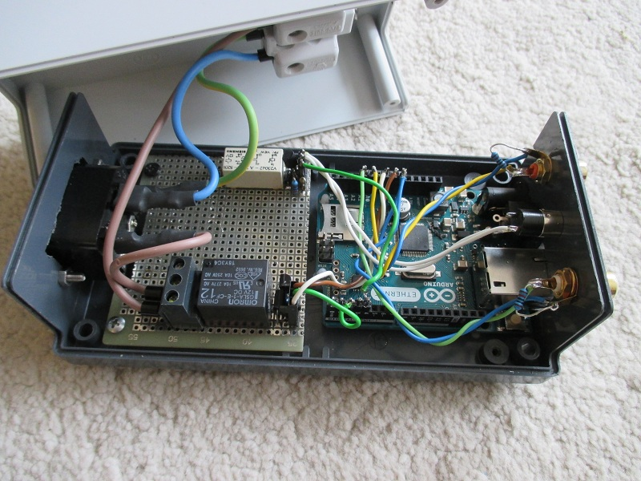
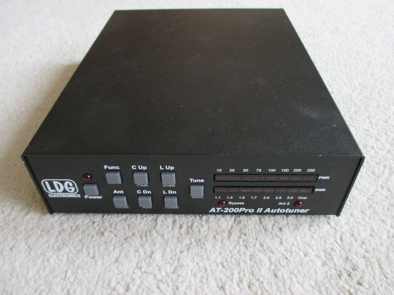
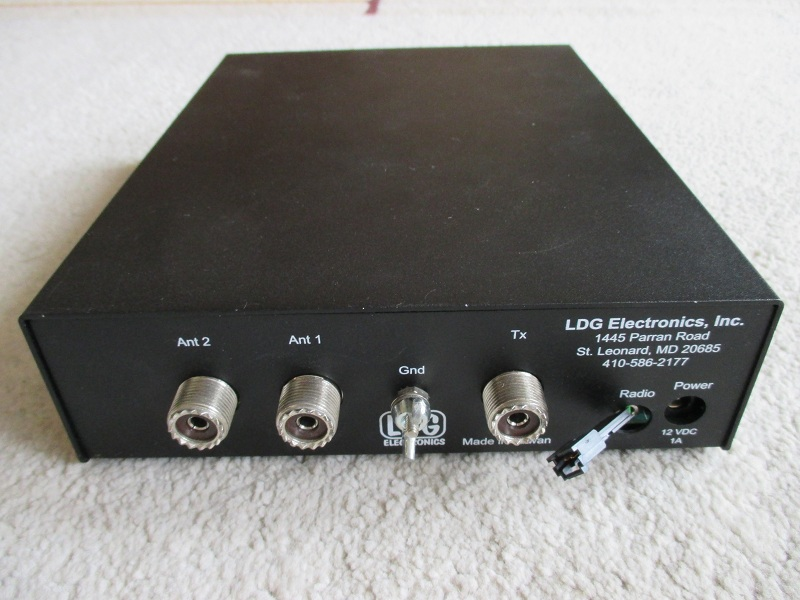
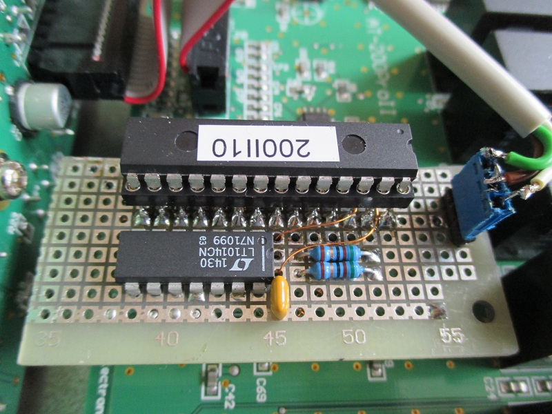

# station
station accessory with arduino ethernet

Arduino Ethernet Box with Python GUI for station remote control.

- turns AC on and off
- band selection for icom IC-735
- Antenna tuner control 
- reads FWD and REF power from Antenna Tuner

The Arduino Ethernet Box will be placed close to the tranceiver and will
be connected via LAN to the network. FWD, REF and Tune cable will be 
connected to the Antenna Tuner. The Power Supply of the Transceiver can 
be switched on and off via the Arduino. When using Red Pitaya, the band 
selection will be directly controlled from the Red Pitaya. When using
Hermes Lite the Arduino can also do the band selection. The Arduino will
be supplied with an 12V Power Supply which is alway connected to mains.
Now the station can be turned on via the Python GUI or from any UDP sender 
with sending ":" (";" turns the station off).

The Python gui will work on Linux and Windows Computers. 

#### GUI

GUI can be started with python station.py

I have installed the following packages:
sudo apt-get install python-wxgtk2.8
sudo apt-get install python-wxgtk3.0

#### Arduino Box

Top
red: FWD, white: REF, 3.5mm: Tune

Bottom
RJ45:Lan, 3.5mm: Band, 2.1mm: 12V-Supply

#### Arduino Box

C13 Power Socket

#### Arduino Box

Relay Board with Arduino Ethernet: big Relais for AC Power - small 
Relais for Antenna Tuner.
Arduino Ethernet board - old revision which is might be not longer 
available. But I have checked the code also on Arduino Leonardo Ethernet 
Board.

#### Antenna Tuner

LDG AT200Pro

#### Antenna Tuner

Back side: because I would not drill a hole to the housing, I have used
a 3pin MTE connector for FWD, GND and REF signal next to the 3.5mm Tune
connector. 

#### Antenna Tuner

shows the modification inside the antenna tuner. I have placed an small
PCB with the driver opamp between microcontroller and socket. So I have
all required signals available (5V, GND, ADC inputs for FWD and REF).
The opamp will be used to drive FWD and REF signals over the cable to 
the Arduino.  

#### Antenna Tuner

Small PCB details - I have used an LT1014 - any other dual amp can be 
used.

Andreas (DL9LJ) - November 2016

